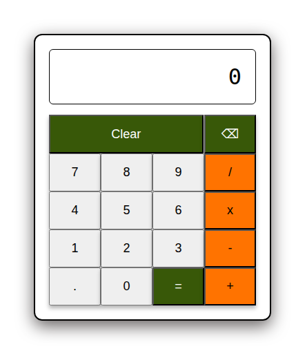

# Calculator

A browser-based calculator built as part of The Odin Project. It supports basic arithmetic operations, keyboard input, decimal calculations, backspace, and error handling.

## Live Demo

https://horseshoeman-clou.github.io/calculator/

## Screenshots

## Features

- Basic arithmetic operations (+, -, x, /)
- Keyboard support
- Decimal number support
- Prevents multiple decimal points
- Division by zero handling
- Backspace functionality
- Clear button
- Floating-point rounding to avoid precision issues
- Continuous calculations after pressing `=`

## Built With

- HTML
- CSS
- JAVASCRIPT

## What I Learned

- DOM manipulation
- Event listeners
- State management using JavaScript variables
- Handling keyboard events
- Edge case testing
- Floating-point precision issues in JavaScript
- Organizing code into reusable functions

## Future Improvements

- Percentage (`%`) operator
- Positive/negative (`±`) toggle
- Calculation history
- Scientific mode
- Responsive mobile layout

## Acknowledgements

Built as part of **The Odin Project** Foundations curriculum.
